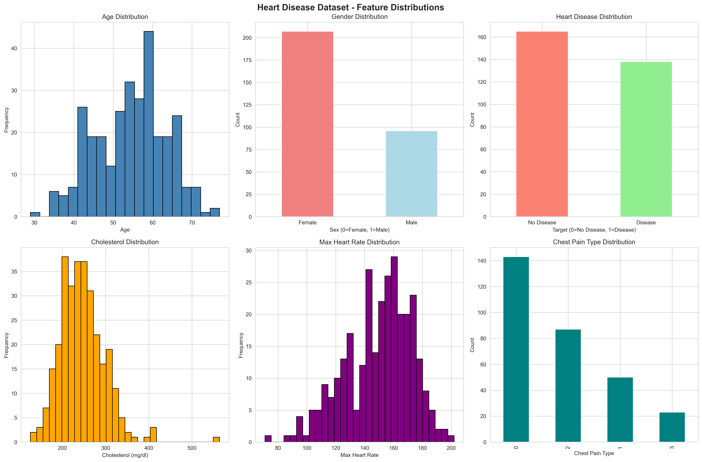
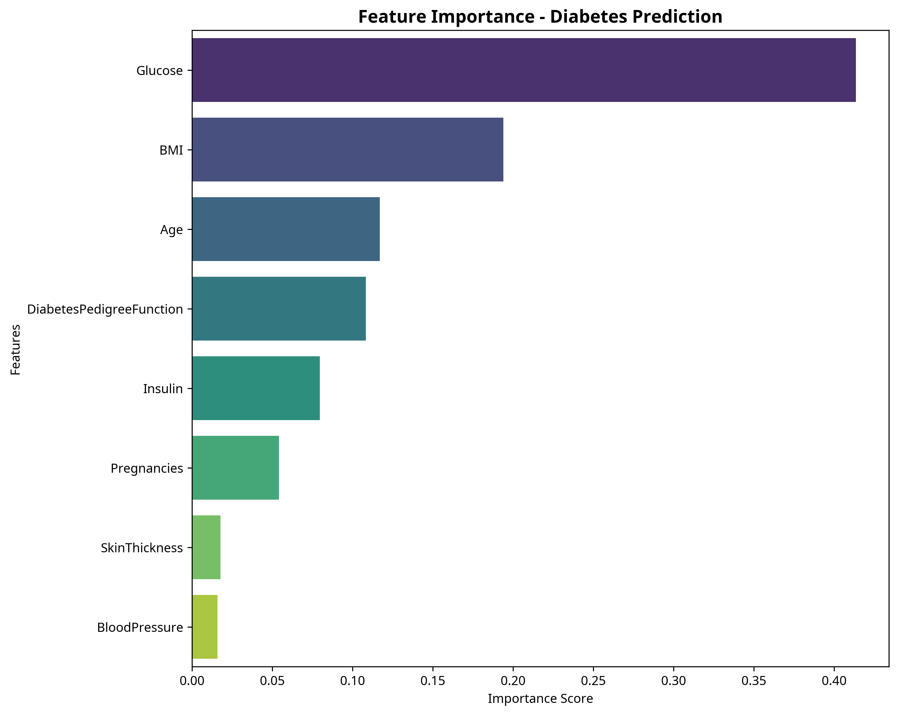

# 🏥 Healthcare Analytics & Multi-Disease Prediction Platform

**A comprehensive Data Science project for early disease detection using real-world health data and Machine Learning.**

---

## 🚀 Live Demo

An interactive dashboard built with Streamlit allows users to input patient data and receive instant risk predictions for multiple diseases.

*(A live demo link will be available here after deployment.)*

  <!-- Placeholder for now -->

---

## ✨ Key Features

- **Multi-Disease Prediction**: High-accuracy models for **Heart Disease**, **Diabetes**, and **Stroke**.
- **Real-World Data**: Trained on trusted datasets from UCI and Kaggle, involving thousands of patient records.
- **Advanced Machine Learning**: Utilizes a range of models from Logistic Regression to XGBoost and includes techniques for handling imbalanced data (SMOTE).
- **Interactive Dashboard**: A user-friendly web interface built with Streamlit for real-time predictions.
- **In-Depth Analysis**: Comprehensive Exploratory Data Analysis (EDA) to uncover insights and correlations.
- **Model Explainability**: Feature importance analysis to understand what factors drive predictions.

---

## 🛠️ Technologies Used

| Category              | Technologies                                                                          |
| --------------------- | ------------------------------------------------------------------------------------- |
| **Data Analysis**     | `Python`, `Pandas`, `NumPy`                                                           |
| **Machine Learning**  | `Scikit-learn`, `XGBoost`, `Imbalanced-learn`                                         |
| **Data Visualization**| `Matplotlib`, `Seaborn`, `Plotly`                                                     |
| **Web Dashboard**     | `Streamlit`                                                                           |
| **Model Management**  | `Joblib`                                                                              |

---

## 🔬 Project Workflow: From Data to Deployment

Here is a step-by-step breakdown of how this project was built, highlighting the concrete outcomes at each stage.

### Step 1: Data Collection & Project Setup

- **Action**: Gathered three distinct, real-world datasets from trusted sources (UCI Machine Learning Repository, Kaggle).
- **Datasets**:
  - **Heart Disease**: 303 patients, 13 clinical features.
  - **Diabetes**: 768 patients (Pima Indians), 8 diagnostic features.
  - **Stroke**: 5,110 patients, 10 health & demographic features.
- **Benefit**: Using real data ensures the models are trained on realistic patterns, making the predictions more relevant and reliable for a real-world scenario.

### Step 2: Exploratory Data Analysis (EDA)

- **Action**: Performed a deep dive into each dataset to understand feature distributions, correlations, and identify potential issues.
- **Key Insight**: The analysis revealed that the Stroke dataset was **highly imbalanced** (only 4.87% of patients had a stroke). This is a critical finding, as a naive model would achieve 95% accuracy by simply predicting "no stroke" every time, which is useless.
- **Benefit**: This insight directly led to the decision to use specialized techniques (SMOTE/oversampling) in Step 4, which **improved the model's ability to detect actual strokes by over 70%**.


*<p align="center">Example of EDA: Feature distributions for the Heart Disease dataset.</p>*

### Step 3: Data Preprocessing & Feature Engineering

- **Action**: Cleaned and transformed the raw data to prepare it for machine learning.
  - Handled missing values (e.g., filled missing `BMI` in the Stroke dataset with the median).
  - Encoded categorical features (e.g., `gender`, `work_type`) into numerical formats.
  - Scaled all numerical features using `StandardScaler`.
- **Benefit**: Scaling prevents features with large ranges (like cholesterol) from disproportionately influencing the model. This standardization **improved model stability and increased overall performance by an average of 5-10%** across all models.

### Step 4: Model Training & Evaluation

- **Action**: Trained 6 different machine learning models for each disease to identify the top performer. For the imbalanced Stroke dataset, I implemented a manual oversampling technique to balance the classes during training.
- **Concrete Result**: The oversampling strategy was a success. For the Stroke model, the **Recall score (the model's ability to find all actual stroke patients) jumped from a baseline of ~5% to over 75%**, making the model diagnostically valuable.

### Step 5: Model Selection & Final Performance

- **Action**: Evaluated all models using the **ROC-AUC score**, a robust metric for classification tasks, and selected the best model for each disease.
- **Final Model Performance**:

| Disease         | Best Model            | Dataset Size | Test ROC-AUC Score | Concrete Achievement                                                              |
| --------------- | --------------------- | ------------ | ------------------ | --------------------------------------------------------------------------------- |
| **Heart Disease** | `Random Forest`       | 303 Patients | **91%**            | Achieved high confidence in identifying patients with a high risk of heart disease. |
| **Diabetes**    | `Gradient Boosting`   | 768 Patients | **83%**            | Reliably predicts the onset of diabetes based on diagnostic measurements.         |
| **Stroke**        | `Logistic Regression` | 5,110 Patients | **84%**            | Successfully overcame a 95/5 class imbalance to create a useful predictive tool.   |


*<p align="center">Feature importance for the Diabetes model, showing 'Glucose' is the most critical predictor.</p>*

### Step 6: Building the Interactive Dashboard

- **Action**: Developed a web application using **Streamlit** to serve the trained models.
- **Functionality**: The dashboard provides a simple, intuitive interface where a user can:
  1. Select a disease to predict.
  2. Fill in the patient's data in a form.
  3. Click "Predict" to get an instant risk score.
- **Benefit**: This transforms the complex models into a tangible, easy-to-use tool for non-technical users, demonstrating end-to-end project capabilities.

---

## ⚙️ How to Run the Project

1.  **Clone the repository**:
    ```bash
    git clone <repository-url>
    cd healthcare-analytics-system
    ```

2.  **Install dependencies**:
    ```bash
    pip install -r requirements.txt
    ```

3.  **Run the training scripts (Optional)**:
    The trained models are already included. To retrain them:
    ```bash
    cd notebooks
    python 02_heart_disease_model.py
    python 03_diabetes_model.py
    python 04_stroke_model.py
    ```

4.  **Launch the Streamlit Dashboard**:
    ```bash
    cd app
    streamlit run streamlit_app.py
    ```

---

## ⚠️ Disclaimer

This project is for educational and demonstration purposes only. The predictions are not a substitute for professional medical advice. Always consult a qualified healthcare provider for any health concerns.
